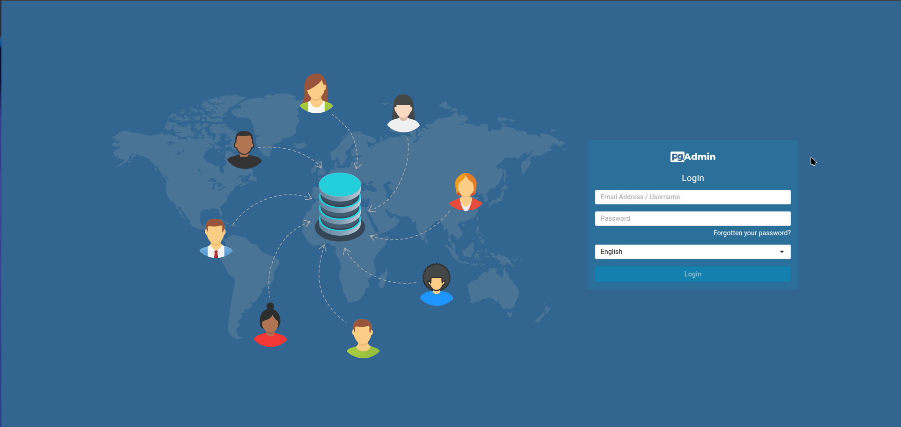
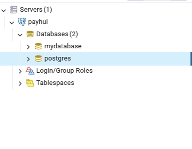

# ИНСТРУКЦИЯ ДЛЯ ПОДКЛЮЧЕНИЯ К PGADMIN (ДЛЯ ОЧЕНЬ ОЧЕНЬ ТУПЫХ) 🧠➡️💩

Добро пожаловать, дорогие разработчики! Если вы читаете это, значит, вы либо очень тупые, либо просто ленивые. Но не переживайте, мы всё объясним так, чтобы даже ваш кофе понял. Или нет. Нам похуй. 🚀

---

## ВАЖНО: ЧИТАЙТЕ ЭТО ОЧЕНЬ ВНИМАТЕЛЬНО (ЕСЛИ, КОНЕЧНО, УМЕЕТЕ ЧИТАТЬ)

### 1. **ОТКРОЙТЕ БРАУЗЕР**  
Да, тот самый, где у вас открыто 500 вкладок с котиками и Stack Overflow. Перейдите по адресу:

```
http://payhui.local:5050
```

Вы должны увидеть


Если вы видите белую страницу, значит, вы что-то сделали не так. Или pgAdmin сломался. Или вы просто тупые. Нам похуй.


---

### 2. **ВВЕДИТЕ ЛОГИН И ПАРОЛЬ**  
На странице входа вы увидите два поля. Вот что нужно ввести:

- **ЛОГИН (EMAIL):** `admin@example.com`  
- **ПАРОЛЬ:** `admin`  

Если вы видите ошибку, значит, вы либо неправильно ввели данные, либо забыли, как печатать. Попробуйте ещё раз. Или не пробуйте. Нам похуй.

---

### 3. **ПРОВЕРЬТЕ ПОДКЛЮЧЕНИЕ**  
Если вы видите базы данных, поздравляем! Вы смогли подключиться к pgAdmin.


Если нет, то, возможно, вы просто тупые. Или pgAdmin сломался. Или PostgreSQL не запущен. Или вы забыли пароль. Или... ну, вы поняли. Нам похуй.

---

## ДЛЯ РАЗРАБОТЧИКОВ КОТОРЫЕ НЕ ПОНЯЛИ 🖕

Если вы дочитали до этого места и всё ещё не смогли подключиться, то, возможно, вам стоит задуматься о смене профессии. Может, попробуйте стать барменом? Или блогером? Или просто продолжайте копировать код с Stack Overflow. Нам похуй.

---

© 2023 PayBat Bank. Все права защищены. Или нет. Нам похуй.